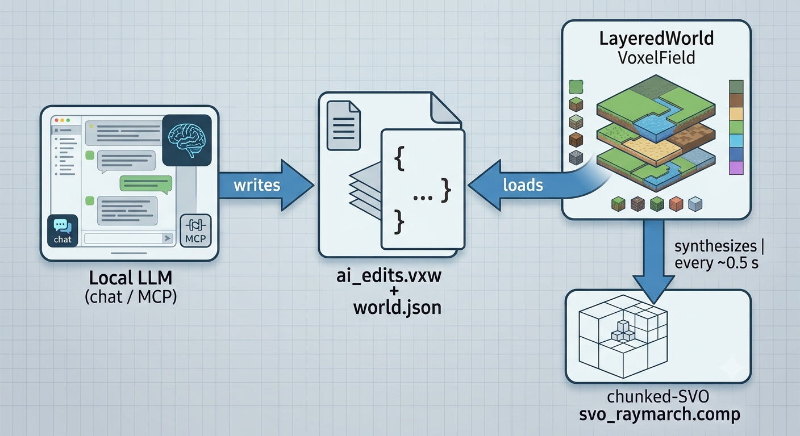

# Voxelforge

A real-time **dynamic voxel world** rendered with a chunked sparse-voxel octree
(SVO) sphere tracer — where a local AI can add, remove and shape voxel objects
at runtime through chat or MCP tool calls, **without ever touching source code**.

Every piece of geometry — rolling terrain, the river, the log cabin, trees,
rocks, fences, anything the AI builds — lives in plain `.vxw` voxel-record
files. The renderer bakes those records into an SVO on the fly and hot-reloads
them while running.



## Features

- **Single render path**: compute-shader sphere tracing over a 16³ chunk grid
  of per-chunk octrees with 8³ bricks (2 × uint32 per voxel: RGB + SDF,
  alpha/refl/rough/material).
- **Records-only geometry** (`src/voxel/voxel_field.*`): terrain comes from
  per-column landscape records, objects from connected components flood-filled
  to solid volumes with a signed distance transform. No analytic scene code in
  the runtime or the shader.
- **Physically-flavoured shading**: ACES tonemapping, PBR-style specular,
  soft shadows from the smooth terrain heightfield + a coarse object-only SDF
  volume (so AI-placed objects cast correct shadows), bent-normal AO,
  Preetham-style sky, altitude fog, animated water with refraction/foam and
  underwater volumetrics, wind-sheared grass and foliage micro-geometry.
- **TAA** in interactive mode.
- **Live world editing**: layer toggles, MCP appends and chat edits land as
  `.vxw` file changes; the app polls mtimes and swaps freshly synthesized SVO
  buffers in-place (~0.5 s). Chat edits trigger the reload immediately.
- **AI tooling**: in-app chat window plus a stdio **MCP server**
  (`vf_mcp`) exposing `add_box / add_cylinder / add_ellipsoid / add_stamp /
  list_layers / enable_layer / probe / ground / clear_edits`.
- **Authoring tools**: `vf_slice` prints ASCII cross-sections of the baked
  field (including AI edits); `--probe` answers point queries.

## Requirements

- Linux, Vulkan 1.3 (dedicated GPU recommended)
- CMake ≥ 3.24, Ninja, a C++20 compiler, Python 3 (for tests)
- `glslangValidator`
- An OpenAI-compatible endpoint or Ollama for the chat backend (optional)

All libraries (spdlog, GLFW, glm, VMA, doctest, ImGui) are fetched automatically.

## Build & first run

```sh
cmake -S . -B build -G Ninja
ninja -C build          # binaries + shaders
ninja -C build world    # bake heightmap + .vxw layers + world.json (once)
./build/voxelforge
```

The app refuses to start without baked assets — `ninja -C build world` runs the
offline baker (`tools/heightmap_gen.cpp`), which writes:

| asset | role |
|---|---|
| `assets/heightmap.png` | baker-side terrain source (2048², 5 cm/texel) |
| `assets/landscape.vxw` | terrain shell records (per lattice column) |
| `assets/house|tree1..6|rock1..3|bushes|alpaca|fence1.vxw` | authored objects |
| `assets/world.json` | layer manifest — order = dedupe priority, first wins a cell |
| `assets/ai_edits.vxw` | highest-priority live layer for chat/MCP edits |

The app starts as a **bare valley**: only `landscape` (+ your AI edits) are
loaded. The "World layers" panel in-app lists every `.vxw` file as a checkbox —
tick `house.vxw`, `tree1.vxw`, … to load them into the running world; untick to
remove them. New files dropped into `assets/` appear after a rescan.

Layers store absolute world coordinates, so a checkbox materializes the object
exactly where it was baked. To place a copy somewhere else, pick an anchor with
`Ctrl+LMB` and hit the layer's **Import** button — it stamps the object at the
selection (bottom-center) by appending translated records to `ai_edits.vxw`,
leaving the original layer untouched.

## Controls

| input | action |
|---|---|
| `WASD` / `Q` `E` | move down/up |
| `RMB` + mouse | look |
| wheel | movement speed (Shift/Ctrl boost/slow) |
| `Ctrl+LMB` | pick a voxel → becomes the bottom-center anchor for AI builds |
| `ESC` | quit |

## AI editing

### In-app chat
The **AI Chat** window talks to any Ollama/OpenAI-compatible server. Pick an
anchor voxel with Ctrl+LMB and ask for *"a 3×3 wood crate"*, *"a small rock"*,
*"a stamp shaped like an arch"*… The model's tool calls are normalized (fuzzy
names, inline JSON, escaped args), executed against `EditableWorld`, and the
world reloads instantly.

```sh
VF_LLM_URL=http://127.0.0.1:11434 VF_LLM_MODEL=qwen2.5 ./build/voxelforge
VF_LLM_URL=http://localhost:8080/v1 ./build/voxelforge   # llama.cpp / vLLM …
```

### MCP server
Register once (already wired for opencode in `.opencode/opencode.json`):

```json
{ "command": "./build/vf_mcp", "args": [] }
```

| tool | effect |
|---|---|
| `ground {x,z}` | terrain height + suggested anchor cell |
| `probe {x,y,z}` | signed distance + material at a point |
| `add_box / add_cylinder / add_ellipsoid / add_stamp` | append records to `ai_edits.vxw` (anchored at `"anchor":[x,y,z]` or `"ground":[x,z]`) |
| `list_layers` / `enable_layer` | inspect/toggle manifest layers |
| `clear_edits` | wipe `ai_edits.vxw` |

Edits are visible to a running instance within ~0.5 s — no repack, no rebuild.

## Command line

```
--selftest              headless acceptance check (sky probe + coverage)
--smoke N               run N frames headless, report timings
--shot out.ppm          render one frame and exit
--cam X Y Z TX TY TZ    camera placement
--sun ELEV AZIM         sun direction (degrees)
--animtime S            deterministic water/grass animation clock
--probe X Y Z           print field distance/material at a point, exit
--width/--height        offscreen resolution for headless modes
--llm-url/--llm-model   chat backend override
```

## Testing

```sh
ctest --test-dir build                     # unit_tests + visual_check
python3 tests/visual_check.py ./build/voxelforge   # 3 canonical shots
./build/voxelforge --selftest --width 640 --height 360
```

Unit tests cover the authoring primitives, stamp semantics, VXW round-trip and
corruption handling, camera math, chat-tool normalization, and cross-check the
baked `VoxelField` against the analytic authoring truth. `visual_check` renders
the hero/house/water shots and asserts coverage, silhouette and sky probes.

## Architecture map

```
src/
  voxel/voxel_field.{hpp,cpp}  records-derived geometry oracle:
                               terrain columns, EDT-flood-filled object grids,
                               sparse object SDF hash, coarse shadow volume
  voxel/layered_world.{hpp,cpp} manifest load/poll, priority merge, SVO synthesis
  voxel/editable_world.{hpp,cpp} ai_edits.vxw writer (box/cylinder/ellipsoid/stamp)
  voxel/worldfile.{hpp,cpp}     VXW v1 container (64 B header + CRC32)
  voxel/common.hpp              constants, palette, BAKER-side analytic shapes
  ai/ollama_client.cpp          HTTP chat client + tool-call parsing
  ai/mcp_server.cpp             vf_mcp stdio JSON-RPC server
  app/chat_ui.cpp               ImGui chat window + tool dispatch
  app/main.cpp                  Vulkan app: swapchain, frames, HUD, picking
  render/svo_pass.cpp           SVO compute pipeline (+ push block, descriptors)
  render/taa_pass.cpp           temporal anti-aliasing resolve
  rhi/*                         context, buffers/images, swapchain
tools/heightmap_gen.cpp         offline asset baker (terrain + authored layers)
tools/scene_slice.cpp           ASCII cross-sections of the baked field
```

Shader truth lives in `shaders/svo_raymarch.comp`: terrain is sampled from a
records-derived `rg32f` height texture (top Y + material), objects from bricks;
shadow rays march the smooth heightfield plus a coarse object-SDF volume.
There are no analytic scene constants in GLSL by design — new geometry only
ever arrives as data.

## Documentation

Full developer documentation lives in **[`docs/`](docs/index.md)**:

| doc | contents |
|---|---|
| [`docs/getting-started.md`](docs/getting-started.md) | build, asset bake, controls, headless modes, troubleshooting |
| [`docs/architecture.md`](docs/architecture.md) | data flow, module tour, synthesis & hot-reload model |
| [`docs/world-format.md`](docs/world-format.md) | VXW v1 binary spec, manifest schema, layer merge rules |
| [`docs/rendering.md`](docs/rendering.md) | GPU contract: handles, brick packing, push block, textures |
| [`docs/ai-editing.md`](docs/ai-editing.md) | chat backend, tool normalization, MCP protocol reference |
| [`docs/tooling.md`](docs/tooling.md) | full CLI/env reference, `vf_slice`, baker, `start.sh` |
| [`docs/testing.md`](docs/testing.md) | test gates, suite breakdown, debug workflows |
| [`docs/contributing.md`](docs/contributing.md) | invariants, conventions, gotchas, how-to recipes |

Historical design docs (records-only rework plan, roadmap, session log) live
in [`docs/history/`](docs/history/). Engineering conventions for coding
agents: [`AGENTS.md`](AGENTS.md).
