# Renderer comparison: Gaussian surfels vs SVO raymarching

Voxelforge renders the **same records-derived world** with two interchangeable
backends. The default is the Gaussian-surfel rasterizer (`--mode splat`,
toggle with **`F`**); the chunked-SVO sphere tracer (`--mode svo`) is kept as
the pixel reference. Everything else — world layers, camera, sun, materials,
post-processing, TAA, the photorealism chain — is shared, so the two modes are
directly comparable frame for frame.

This page shows what actually differs on screen and explains why.

<p align="center">
  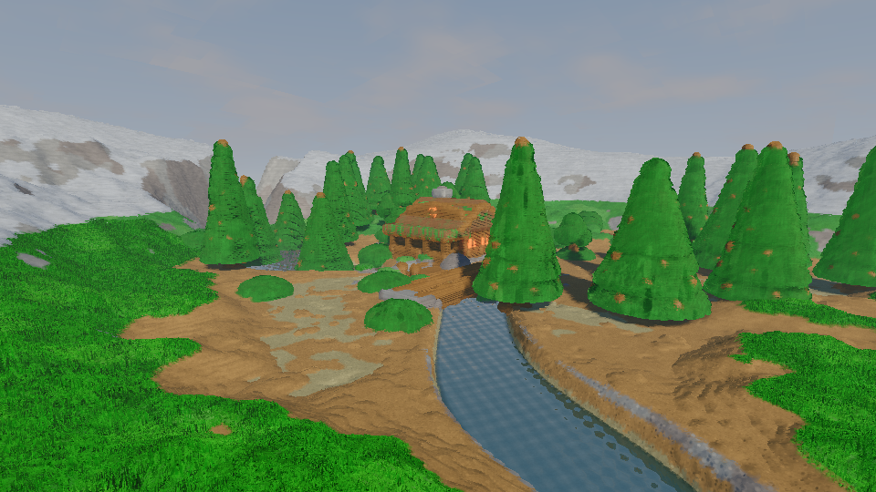
  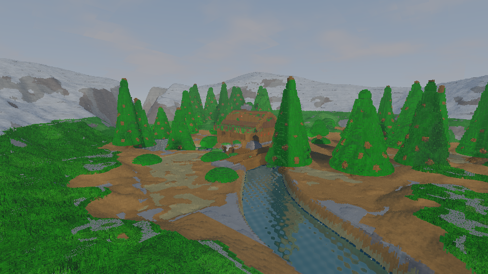
</p>

*Left: Gaussian surfels (`--mode splat`). Right: SVO raymarcher (`--mode svo`).
Same camera, sun and world layers — only the geometry pass differs.*

## At a glance

| | **Gaussian surfels** (`--mode splat`, default) | **SVO raymarcher** (`--mode svo`, reference) |
|---|---|---|
| Primitive | one 64 B 2D Gaussian disk per outer surface cell | exact SDF sphere tracing through brick-packed voxels |
| Visibility | instanced quads, depth prepass + opaque base + Gaussian band | per-pixel octree traversal with 8³ brick SDFs |
| Silhouettes | soft, rounded (Gaussian footprint ≈ 1.4 cells) | hard per-voxel stair steps |
| Shadows / AO | baked per surfel on the CPU at world-reload time | marched exactly per pixel at render time |
| Terrain LOD | merged tri-scale rings (`VF_LOD`) | none — always full detail |
| Micro detail | texture-texel child disks (`VF_MICRO`) | none |
| Culling | frustum + GPU compaction + Hi-Z occlusion | per-ray empty/solid subtree masks |
| Best for | interactive look, moving cameras, object-heavy views | correctness reference, A/B of shading changes |

## How to switch

```sh
./build/voxelforge                       # splat (default)
./build/voxelforge --mode svo            # SVO reference
./build/voxelforge --mode splat --width 1280 --height 720 \
    --shot out.ppm --cam X Y Z TX TY TZ  # headless single frame, either mode
```

Interactively, **`F`** swaps the backend in place; **`N`** toggles TAA (shared
by both). The switch is instantaneous — both backends read the same uploaded
`GpuWorld` / surfel buffers and write the same HDR + G-buffer targets, so the
TAA resolve, post pass and photorealism chain (SSR/SSAO/volfog/motion
blur/DoF) run unchanged. See [Rendering & GPU contract](rendering.md) for the
binding-by-binding contract.

## What is shared

- **Geometry source.** Both backends see geometry only through the
  records-derived `VoxelField` — terrain columns plus flood-filled object
  components. No analytic scene constants exist in either shader.
- **Shading model.** `common_base.glsl` (sky, GGX + diffuse, AO/bent
  normals, foliage translucency, fog, water tint) is linked into both.
- **Camera, sun, animation clock.** One `RaymarchPush` / params block, so
  `--cam`, `--sun` and `--animtime` frame both modes identically.
- **Outputs.** Identical `rgba16f` HDR + G-buffer images, so `--shot`, TAA
  and the post chain are backend-agnostic.

The differences below are therefore **only** the geometry representation and
how shading inputs (normals, shadows, AO) are obtained.

## Gallery

Each pair is the same frame rendered in both modes at 960×540
(headless, TAA off, default sun 34°/238°, `--animtime 0`). The exact
commands are in [Reproducing these screenshots](#reproducing-these-screenshots).

### 1. Riverside valley (hero)

| Gaussian surfels | SVO raymarcher |
|---|---|
|  |  |

The splat frame reads as a continuous surface: soft canopies, smooth moss
mottling on the valley floor, and a water surface that blends into the banks.
The SVO frame exposes the lattice underneath — stepped tree silhouettes,
per-cell terrain shelling, and hard snow/rock material boundaries. Both
frames share the same framing, lighting direction and fog; the SVO image is
simply the raw voxel surface of the same data.

### 2. Cabin close-up

| Gaussian surfels | SVO raymarcher |
|---|---|
| 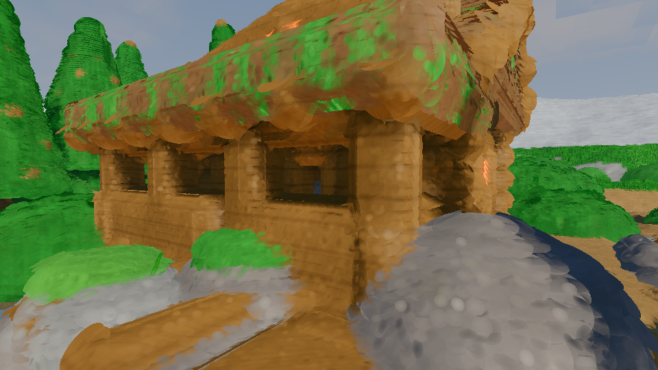 | 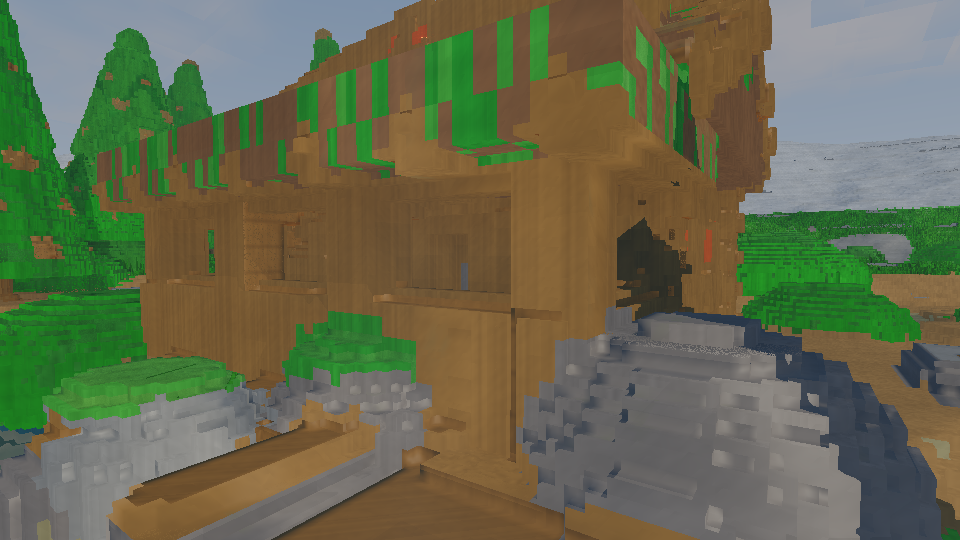 |

At close range the surfel path smooths the roof pitch and log walls (the
Gaussian footprint spans ~1.4 cells, so the first hit sits about half a voxel
outside the brick boundary), while the SVO path resolves every brick edge and
window reveal. Because the reconstructed first-hit surfaces differ by up to
about a voxel, some small features (eave depth, window openings) read
differently between the two images — the geometry is the same, the surface
*estimate* is not.

### 3. Forest canopy

| Gaussian surfels | SVO raymarcher |
|---|---|
| 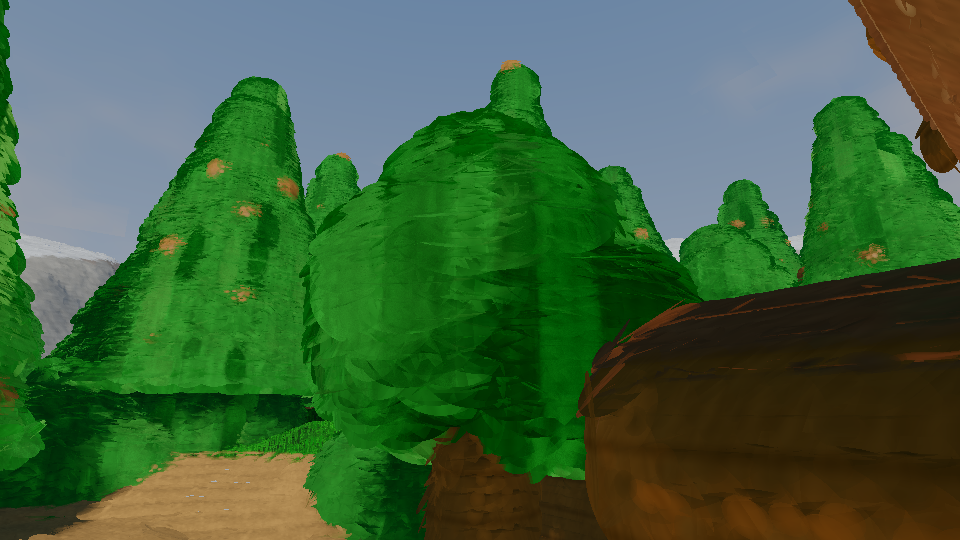 | 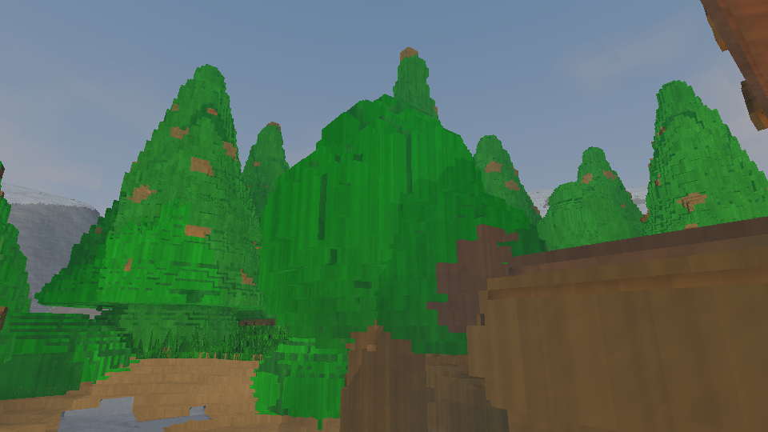 |

The conifers are the clearest illustration of the representation gap: surfels
render them as overlapping soft leaf disks with micro-detail leaflet
silhouettes, while the raymarcher turns the identical records into stacked
voxel terraces. Foliage is also where the surfel bake deliberately
compensates (1.5× disks for sparse canopy, mat 8) to keep the canopy closed.

### 4. Shore and water

| Gaussian surfels | SVO raymarcher |
|---|---|
| 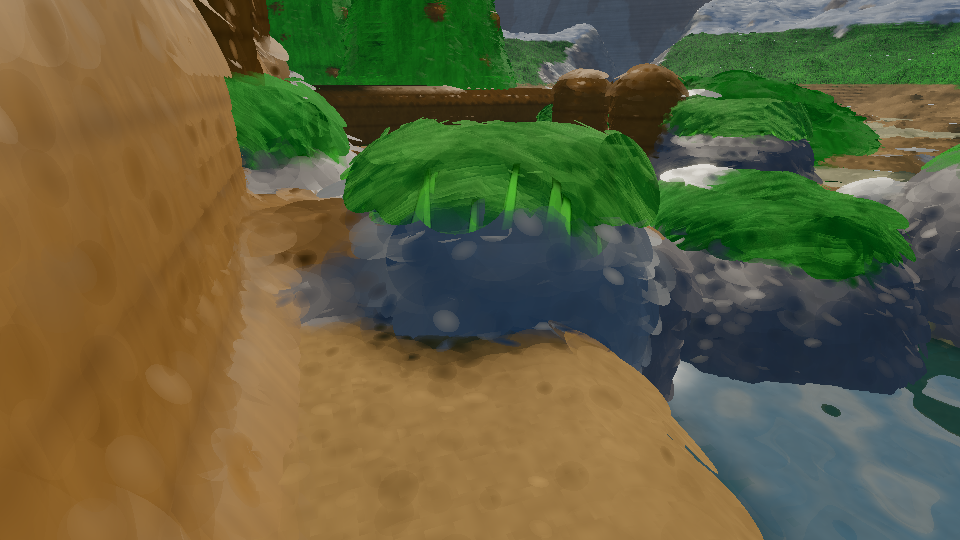 | 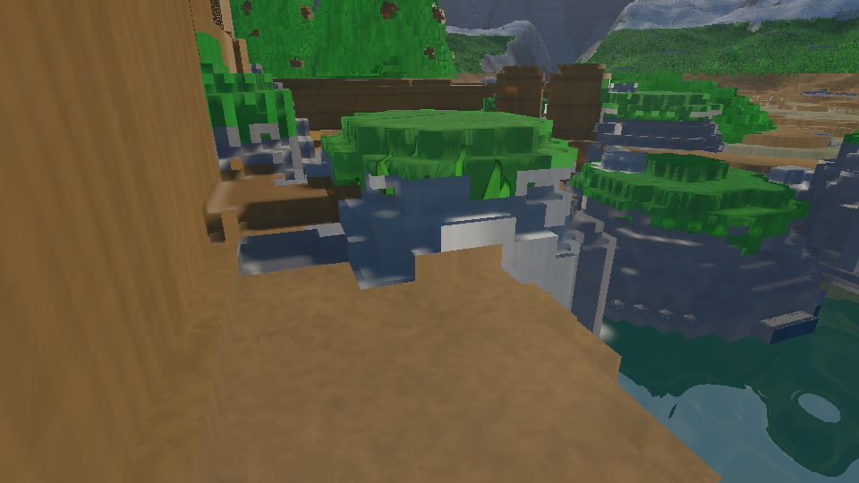 |

Water takes two different but visually consistent routes. The raymarcher
intersects the analytic plane at `y = -0.9` bidirectionally and can show the
brick-layered bed and refraction underneath. The splat path rasterizes a
0.25 m water-surfel grid, depth-tests it against the opaque prepass, and
shades it with `shadeWaterSplat` (its GPU shadow march is the one place
surfels still sphere-trace the object volume). Foam, sparkle and the water
line agree closely between backends.

### 5. Valley overview

| Gaussian surfels | SVO raymarcher |
|---|---|
| 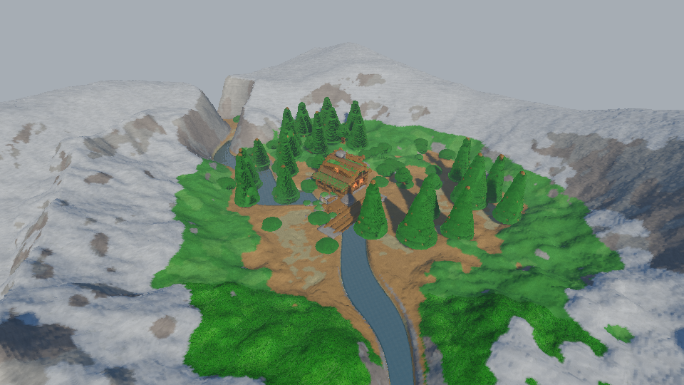 | 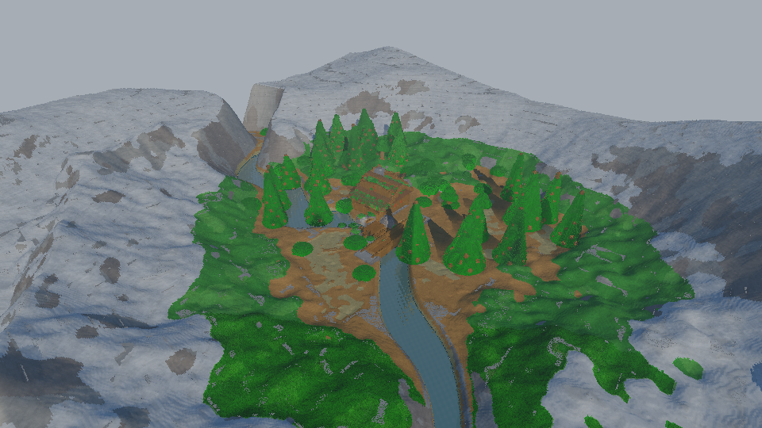 |

From altitude the splat path switches distant terrain to the baked merged
LOD rings, so the mountain shell stays smooth, while the SVO reference keeps
full per-column detail and shows voxel speckle at grazing angles. This is the
one view where the gap is mostly **cost management** rather than fidelity:
SVO has no LOD, surfels do.

## Pixel-level zooms

2× nearest-neighbour crops from the shots above. Left half of each image is
the surfel render, right half the SVO render of the same pixels.

**Canopy** — Gaussian disks vs brick terraces:

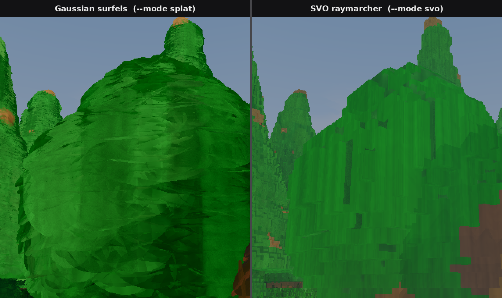

**Cabin** — soft roof/log shading vs hard brick silhouette and stair-stepped
eaves:

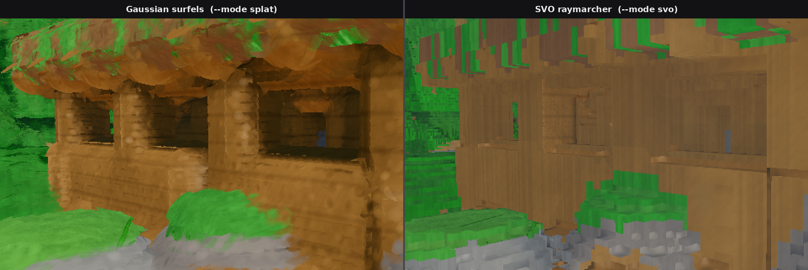

**Shore** — foam/pebble micro-surfels vs the analytic water plane meeting the
submerged sediment bricks:

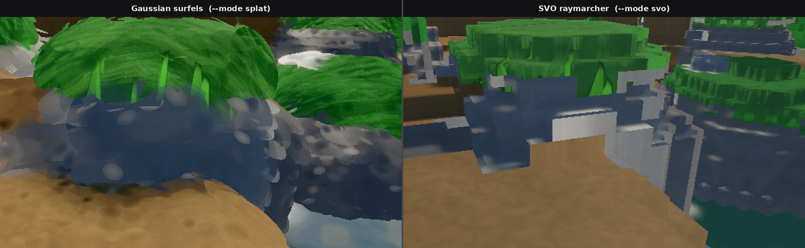

## How each backend works

### Gaussian surfels (`src/render/splat_pass.*`, `shaders/splat.{vert,frag}`)

- The CPU bake (`src/voxel/surfelize.*`) emits one 64 B surfel per outer
  surface cell: position, normal, radii (isotropic 1.4 cells today), baked
  shadow, bent-normal AO, material — plus optional deterministic micro-detail
  children per texture texel. Rebuilt from the live `VoxelField` on every world
  reload (~2.5 s for the default scene, 8.17 M surfels incl. water).
- Rendering is five pipelines over instanced quads sharing one layout:
  fullscreen sky → depth-only prepass (one draw per visible chunk) → opaque
  base (depth EQUAL, no blend) → Gaussian band (dynamic depth bias, blended,
  LESS) → water surfels. No pass writes `gl_FragDepth`, so early-Z bounds
  shading to the front surface band.
- Per-frame GPU work: frustum cull, optional compute compaction/cull
  (`VF_NO_GPU_CULL=1` disables), optional Hi-Z occlusion pyramid
  (`VF_NO_OCCL=1`), back-to-front chunk sort. Terrain uses three baked LOD
  rings with draw-time selection at 20 m / 60 m.
- The experimental compute tile path (`VF_TILE=1`) replaces the two forward
  raster passes but is not yet at parity or faster; forward remains the default.

### SVO raymarcher (`src/render/svo_pass.*`, `shaders/svo_raymarch.comp`)

- `LayeredWorld` synthesizes a 16³ chunk grid of per-chunk octrees with 8³
  bricks; per voxel two u32 words carry `r|g|b|sdfByte` and
  `a|refl|rough|matOrObj`. Chunks entirely below the terrain top become solid
  terminals so underground rays terminate in O(1).
- Rays step: world AABB → terrain heightfield trace → chunk/octree traversal
  with payload masks → brick SDF sphere tracing → water plane. Shading uses
  gradient normals at object surfaces, exact binary DDA shadows (`softShadow`)
  and terrain heightfield normals.
- No LOD, no baked shading inputs, no culling buffers — the pixel cost is the
  scene complexity per ray, which is what makes it the reference.

## Performance

Measured on the hero camera (`-16 6.5 -14 → 6.5 0.8 11`), RTX 4090 Laptop,
headless (TAA disabled), GPU timestamp EMA at frame ≥ 120:

| resolution | splat `geo` | SVO `geo` | splat `--smoke` avg | SVO `--smoke` avg |
|---|---|---|---|---|
| 960×540 | 9.8–9.9 ms | 13.0 ms | 9.8 ms | 13.1 ms |
| 1280×720 | 12.5 ms | 19.6 ms | 12.6 ms | 19.6 ms |

`geo` is the geometry pass (`profMark(0..1)`); post is ~0.05–0.12 ms in both
modes and the photorealism passes are off in headless. On this view the surfel
path is ~25–35 % faster than the reference. The tile path and per-pass A/B
history in [Rendering](rendering.md#gaussian-surfel-renderer-primary-path---mode-splat)
records how the surfel alpha rework bounded close-up overdraw (near-tree
`geo` 55 → 5.9 ms at 640×360, 113 → 10 ms at 1280×720) — the earlier
close-up collapse came from unbounded disk overdraw, not the representation.

Memory is the other axis: the SVO world for the default scene is ~160 MB
(11,348 nodes / 40,801 bricks / 459 active chunks), while the uploaded surfel
SSBO is ~0.5 GB (8.17 M × 64 B, water/LOD/micro included). World load is
dominated by SVO synthesis (~6.8 s) plus the surfel bake (~2.5 s); both rerun
on every layer change.

## Accuracy, determinism and testing

- `--mode svo` is the **pixel reference**: shading changes are validated there
  first, then mirrored in `common_base.glsl` so both backends stay in sync.
- Headless shots are deterministic in both modes (TAA and the animation clock
  are frozen), which is what the test gates rely on:
  `python3 tests/visual_check.py build/voxelforge` renders hero/house/water
  with the default splat path and asserts coverage, silhouette and sky
  probes; `./build/voxelforge --selftest` does the same for one frame. When
  changing `svo_raymarch.comp`, run the same shots manually with `--mode svo`
  (or add the flag in `tests/visual_check.py`) alongside the splat gate.
- The tile project (`VF_TILE=1`) is where exact per-pixel parity between the
  two raster paths is being proven; water already matches bit-exactly.

## Tuning knobs (splat path)

All environment variables, defaults tuned:

| var | effect |
|---|---|
| `VF_SPLAT_SIGMA` / `VF_SPLAT_OPACITY` | Gaussian kernel shape (default 0.5 / 0.9) |
| `VF_SPLAT_RADIUS` / `VF_SPLAT_EXTENT` | disk footprint (also live via `[` / `]`) |
| `VF_SPLAT_DEPTH_TOL` | depth-resolve band, default 0.002 |
| `VF_MICRO=0` | disable micro-detail child disks |
| `VF_LOD=0`, `VF_LOD1`, `VF_LOD2` | merged terrain LOD rings / selection distances |
| `VF_NO_GPU_CULL=1`, `VF_NO_OCCL=1` | disable GPU compaction / Hi-Z occlusion |
| `VF_SPLAT_NOCULL`, `VF_SPLAT_NOWATER` | debug: no culling / no water surfels |
| `VF_SPLAT_DEBUG=1..14` | flat/normal/depth/shadow/AO/kernel-mask visualisation |

The SVO path has no matching runtime knob set by design — changing the
reference would defeat its purpose.

## Reproducing these screenshots

Shots are 960×540 headless PPMs converted to PNG; no TAA, default sun and
animation clock:

```sh
CAM="-16 6.5 -14 6.5 0.8 11"                       # hero
# also: house "2.5 1.3 6.0 6.8 1.0 12.2"
#       water "8.5 0.6 8.2 4.5 -1.1 6.8"
#       closeup "9.8 1.2 10.4 12.5 2.2 12.5"
#       overview "-25 30 -25 5 0 10"

for mode in splat svo; do
  ./build/voxelforge --shot "$mode.ppm" --width 960 --height 540 \
      --mode "$mode" --cam $CAM
done
python3 -c "from PIL import Image; [Image.open(f).save(f[:-4]+'.png') for f in ['splat.ppm','svo.ppm']]"
```

## When to use which

- **Interactive / product view:** splat — smooth silhouettes, cheaper at
  distance, GPU culling and LOD keep object-heavy and close-up views fast.
- **Verifying shading, shadows or geometry bugs:** SVO — no baked
  approximations, exact per-pixel verdicts.
- **Comparing a change:** render both (`F` to toggle live) before/after; the
  shared G-buffer and post chain make differences attributable to geometry or
  shading rather than pipeline plumbing.

See also: [Rendering & GPU contract](rendering.md) for the full data layout,
shading chain and push-block documentation.
